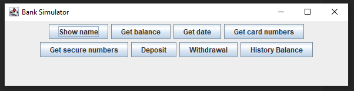
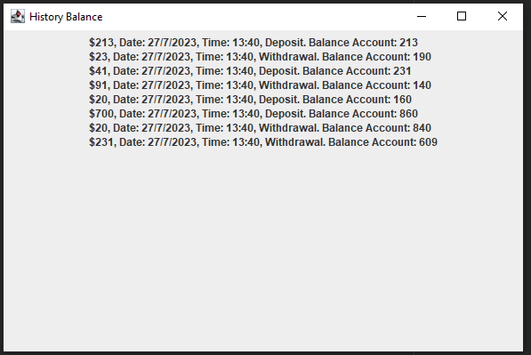

# BankSimulator
Este projeto é apenas para estudos.

BankSimulator, como o nome já diz, é um simulador de banco. utilizando JFrame para criar a interface de usuário e JButton para criar os botões de interação com a conta bancária.

Ainda falta muitas coisas, como por exemplo, adicionar histórico de saque e depósito, crédito e débito, fechamento de fatura.

Sinta-se à vontade para testar e me relatar qualquer problema ou sugestão.

**Version** : 1.0

